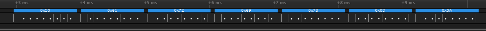

* `Esc`: ASCII code 27
* `Space`: ASCII code 32
* `Tab`: ASCII code 9
* `Enter`: ASCII code 13

   | **Function name** | **Function parameter(s)** | **Description** | **Example** |
   | :-- | :-- | :-- | :-- |
   | `uart_init` | `UART_BAUD_SELECT(9600, F_CPU)` | Initialize UART to 8N1 and set baudrate to 9600&nbsp;Bd | `uart_init(UART_BAUD_SELECT(9600, F_CPU));` |
   | `uart_getc` | `my input` | return byte from ringbuffer | `uart_putc(value);` |
   | `uart_putc` | `'char'` | write byte to ringbuffer for transmitting via UART | `uart_putc('H');` |
   | `uart_puts` | `"string"` |  transmit string to UART | `uart_puts("Paris\r\n");` |

   | **Char** | **Decimal** | **Hexadecimal** | **Binary** |
   | :-: | :-: | :-: | :-: |
   | `a` | 97 | `0x61` | `0b0110_0001` |
   | `b` | 98 | `0x62` | `0b0110_0010` |
   | `c` | 99 | `0x63` | `0b0110_0011` |
   | `0` | 48 | `0x30` | `0b0011_0000` |
   | `1` | 49 | `0x31` | `0b0011_0001` |
   | `2` | 50 | `0x32` | `0b0011_0010` |
   | `Esc` | 27 | `0x1b` | `0b0001_1011` |
   | `Space` | 32 | `0x20` | `0b0010_0000` |
   | `Tab` | 9 | `0x9` | `0b0000_1001` |
   | `Backspace` | 8 | `0x8` | `0b0000_1000` |
   | `Enter` | 13 | `0xd` | `0b0000_1101` |